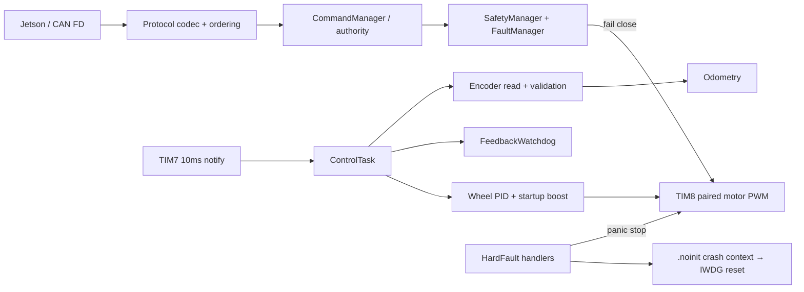

# Chassis Controller V1 架构与面试要点

## 项目亮点

1. STM32G474 + FreeRTOS 的10ms双轮闭环，控制任务实测 max 29us。
2. CAN FD command/heartbeat/sequence timeout 与 authority ownership 一体化 fail-close。
3. 正反转 encoder feedback-loss 使用幅值阈值和 elapsed-tick 语义，software injection 四象限验证。
4. HardFault 先清零PWM，再持久化 Cortex-M4F basic/extended frame，重启后可由同一ELF定位。
5. PowerReady 区分 STOPPED无主电源与运动中欠压，既允许正常启动又避免危险运动。
6. 自动 Release manifest 绑定 source、toolchain、ELF/BIN/OTA hash 和硬件验证范围。

## 面试问题

1. 为什么 encoder failure 必须同时停两轮，而不是只停故障侧？
2. 为什么 watchdog 比较 output magnitude，而不是只看 target？
3. 为什么低PWM时不启动 feedback-loss timer？
4. missed tick 为什么必须同时作用到 encoder、odom、slew 和 PID dt？
5. 为什么 HardFault handler 先急停，再保存 crash context？
6. Cortex-M4F 的 EXC_RETURN bit4 在异常现场中代表什么？
7. 为什么 Release ELF 保留 DWARF，但 BIN/OTA不增加体积？
8. Command timeout 和 peer heartbeat timeout 为什么要分开？
9. 为什么 DWT数据不能描述成 ISR→task wake jitter？
10. Firmware source commit 和 evidence commit 为什么可以不同？
